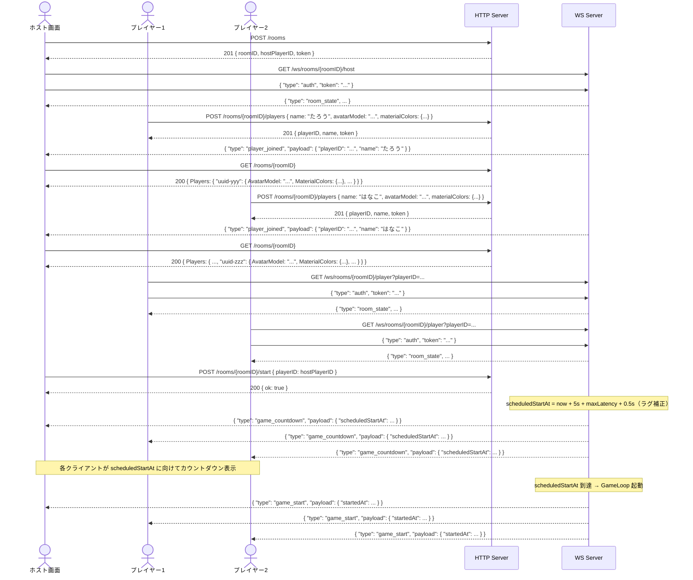
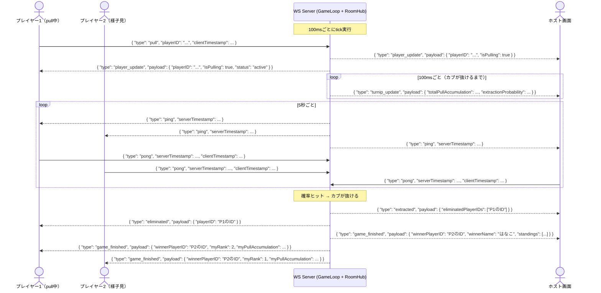

# API リファレンス

フロントエンド実装者向けの外部公開APIリファレンス。  
認証方式の詳細は [auth.md](auth.md) を参照。

---

## 概要

| 項目 | 値 |
|---|---|
| ベースURL | `http://<host>:8080` |
| Content-Type | `application/json`（POST/PUT時） |
| 認証 | JWT（WS接続後の最初のメッセージで送信） |

---

## HTTP API

### POST /rooms — ルーム作成

ホストがルームを作成する。作成と同時に `hostPlayerID` が発行される。

**リクエスト**: ボディなし

**レスポンス**: `201 Created`

```jsonc
{
  "roomID": "abc12345-...",       // ルームの一意ID（UUID v4）
  "hostPlayerID": "uuid-xxx",    // ホスト用プレイヤーID（UUID v4）
  "token": "<JWT>"               // WS接続時に使うJWT（有効期限24h）
}
```

**エラー**

| ステータス | 説明 |
|---|---|
| 500 | サーバー内部エラー |

---

### GET /rooms/{roomID} — ルーム情報取得

ルームの現在状態を取得する。

**パスパラメータ**

| 名前 | 説明 |
|---|---|
| `roomID` | ルームID |

**レスポンス**: `200 OK`

```jsonc
{
  "ID": "abc12345-...",            // ルームID
  "HostPlayerID": "uuid-xxx",     // ホストのプレイヤーID
  "Status": "waiting",            // "waiting" | "countdown" | "playing" | "finished"
  "Players": {
    "uuid-xxx": {
      "ID": "uuid-xxx",
      "Name": "host",
      "Status": "active",         // "active" | "eliminated"
      "IsPulling": false,
      "PullAccumulation": 0.0,    // このプレイヤーの累積pull量
      "LatencyMs": 0,             // 推定片道ラグ（ms）
      "ClockOffsetMs": 0,         // クライアント時計のズレ（ms）
      "JoinedAt": "2024-06-15T12:00:00Z",
      "AvatarModel": "turnip_a",  // アバターのモデル種類（参加時に登録）
      "MaterialColors": {         // マテリアル名 → カラーコードのマップ（参加時に登録）
        "body": "#ff6b6b",
        "leaf": "#51cf66"
      }
    }
  },
  "Turnip": {
    "TotalPullAccumulation": 0.0,    // 全プレイヤー合計のpull量
    "ExtractionProbability": 0.0,    // カブが抜ける現在確率（0.0〜1.0）
    "IsExtracted": false,
    "ExtractedAt": null
  },
  "Rounds": [],                   // ラウンド結果（将来のラウンド制用）
  "Winner": null,                 // 勝者（null = ゲーム中 or 引き分け）
  "CreatedAt": "2024-06-15T12:00:00Z",
  "ScheduledStartAt": null,        // カウントダウン開始後に設定されるゲーム開始予定時刻
  "StartedAt": null,
  "FinishedAt": null
}
```

**エラー**

| ステータス | 説明 |
|---|---|
| 404 | ルームが存在しない |

---

### POST /rooms/{roomID}/players — ルーム参加

プレイヤーがルームに参加する。WAITING状態のルームのみ受け付ける。
この時点ではプレイヤー情報だけを登録し、ホスト側の参加者一覧へはまだ表示しない。
参加者一覧へ反映されるのは、そのプレイヤーがJWTで認証済みのWebSocket接続を確立した後。

**パスパラメータ**

| 名前 | 説明 |
|---|---|
| `roomID` | 参加するルームのID |

**リクエストボディ**

```jsonc
{
  "name": "たろう",          // プレイヤー名（必須、空文字不可）
  "avatarModel": "turnip_a", // アバターのモデル種類（任意）
  "materialColors": {        // マテリアル名 → カラーコードのマップ（任意）
    "body": "#ff6b6b",
    "leaf": "#51cf66"
  }
}
```

**レスポンス**: `201 Created`

```jsonc
{
  "playerID": "uuid-yyy",   // 発行されたプレイヤーID（UUID v4）
  "name": "たろう",          // 登録された名前
  "token": "<JWT>"          // WS接続時に使うJWT（有効期限24h）
}
```

**エラー**

| ステータス | 説明 |
|---|---|
| 400 | リクエストボディが不正（nameなし等） |
| 404 | ルームが存在しない |
| 409 | ゲームがすでに開始している |

---

### POST /rooms/{roomID}/start — ゲーム開始

ホストがゲームを開始する。`playerID` がホストのIDと一致する場合のみ実行可能。

**パスパラメータ**

| 名前 | 説明 |
|---|---|
| `roomID` | ルームID |

**リクエストボディ**

```jsonc
{
  "playerID": "uuid-xxx"   // ホストのplayerID（ホスト権限確認に使用）
}
```

**レスポンス**: `200 OK`

```jsonc
{
  "ok": true
}
```

成功すると以下の順でWSイベントが送信される:

1. **即座に** `game_countdown` — 全クライアントへゲーム開始予定時刻を通知
2. **`scheduledStartAt` 到達後に** `game_start` — ゲームループ開始と同時に送信

`scheduledStartAt` はプレイヤーの最大ラグを考慮して計算される（詳細は「ラグ補正」参照）。

**エラー**

| ステータス | 説明 |
|---|---|
| 400 | リクエストボディが不正 |
| 403 | ホストのplayerIDと一致しない |
| 404 | ルームが存在しない |
| 409 | ゲームがすでに開始している |
| 500 | WSハブが見つからない |

---

### DELETE /rooms/{roomID} — ルーム削除

ルームとWSハブを削除する。ゲーム終了後の明示的な後片付けに使用する。

**パスパラメータ**

| 名前 | 説明 |
|---|---|
| `roomID` | 削除するルームのID |

**レスポンス**: `204 No Content`（ボディなし）

---

## WebSocket API

### エンドポイント

| 画面 | エンドポイント | 説明 |
|---|---|---|
| ホスト画面 | `GET /ws/rooms/{roomID}/host` | カブのアニメーション・ゲーム全体状態 |
| コントローラー | `GET /ws/rooms/{roomID}/player?playerID=xxx` | 操作UI・個人状態 |

### 接続フロー（認証）

WS接続確立後、**5秒以内**に `auth` メッセージを送信する必要がある。
詳細は [auth.md](auth.md) を参照。

```jsonc
// WS接続後 最初に送るメッセージ
{ "type": "auth", "token": "<JWT>" }
```

認証成功後に `room_state` が返る。タイムアウトや検証失敗時は `1008 Policy Violation` で切断される。

---

## WSイベント一覧

### クライアント → サーバー

| type | 送信元 | 説明 |
|---|---|---|
| `auth` | ホスト・コントローラー両方 | WS接続後の最初の認証メッセージ |
| `pull` | コントローラー | カブを引き始める操作 |
| `release` | コントローラー | カブから手を離す操作 |
| `pong` | ホスト・コントローラー両方 | サーバーの `ping` への応答（クロック同期） |

#### auth

```jsonc
{
  "type": "auth",
  "token": "<JWT>"   // POST /rooms または POST /rooms/{roomID}/players で取得したJWT
}
```

#### pull

```jsonc
{
  "type": "pull",
  "playerID": "uuid-yyy",          // 自分のplayerID
  "clientTimestamp": 1718425600123  // クライアントの現在時刻（Unixミリ秒）
}
```

`clientTimestamp` はサーバー側でラグ補正に使用される。

#### release

```jsonc
{
  "type": "release",
  "playerID": "uuid-yyy",          // 自分のplayerID
  "clientTimestamp": 1718425600456  // クライアントの現在時刻（Unixミリ秒）
}
```

#### pong

```jsonc
{
  "type": "pong",
  "serverTimestamp": 1718425600000, // pingで受け取った値をそのまま返す
  "clientTimestamp": 1718425600045  // pong送信時のクライアント現在時刻（Unixミリ秒）
}
```

---

### サーバー → ホスト画面

| type | タイミング | 説明 |
|---|---|---|
| `room_state` | 接続・認証成功直後 | ルームの現在状態スナップショット |
| `player_joined` | プレイヤーのWebSocket認証成功時 | 参加者一覧へ追加する通知 |
| `player_left` | プレイヤーのWebSocket切断時 | 参加者一覧から外す通知 |
| `game_countdown` | ホストがゲーム開始を宣言した直後 | ゲーム開始予定時刻の通知（カウントダウン用） |
| `game_start` | `scheduledStartAt` 到達時 | ゲームループ開始通知 |
| `ping` | 5秒ごと | クロック同期用（`pong` を即座に返すこと） |
| `turnip_update` | 100msごと（tick） | カブの現在状態（アニメーション用） |
| `player_update` | pull/release受信時 | プレイヤーのpull状態変化 |
| `extracted` | カブが抜けた瞬間 | 脱落プレイヤー一覧 |
| `game_finished` | ゲーム終了時 | 勝者・最終順位 |

#### room_state（ホスト）

```jsonc
{
  "type": "room_state",
  "payload": {
    "status": "waiting",      // "waiting" | "playing" | "finished"
    "players": [
      {
        "playerID": "uuid-xxx",
        "name": "host",
        "status": "active",       // "active" | "eliminated"
        "isPulling": false,
        "pullAccumulation": 0.0   // このプレイヤーの累積pull量
      }
    ],
    "turnip": {
      "totalPullAccumulation": 0.0,    // 全体の累積pull量（カブ抜け確率のインプット）
      "extractionProbability": 0.0     // カブが抜ける現在確率（0.0〜1.0）
    }
  }
}
```

`players` には現在WebSocket接続中のメンバーだけが含まれる。

#### player_joined

```jsonc
{
  "type": "player_joined",
  "payload": {
    "playerID": "uuid-yyy",   // 参加したプレイヤーのID
    "name": "たろう"           // プレイヤー名
  }
}
```

アバター情報は `GET /rooms/{roomID}` のレスポンスに含まれる。

WAITING中でも送信される。ホスト画面の参加者リスト更新に使用する。
同じ `playerID` が再接続した場合もこのイベントで再追加する。

#### player_left

```jsonc
{
  "type": "player_left",
  "payload": {
    "playerID": "uuid-yyy"   // 切断したプレイヤーのID
  }
}
```

ホスト画面の参加者リストから対象プレイヤーを外すために使う。

#### game_countdown

```jsonc
{
  "type": "game_countdown",
  "payload": {
    "scheduledStartAt": 1718425605700   // ゲーム開始予定時刻（サーバー絶対時刻 / Unixミリ秒）
  }
}
```

クライアントはこの値を使ってカウントダウンを表示する。
クロックズレがある場合は `ClockOffsetMs` で補正すること:

```
表示残り時間 = scheduledStartAt - ClockOffsetMs - Date.now()
```

`scheduledStartAt` はプレイヤー全員が受信できるよう最大レイテンシ分だけ余裕を持たせた値になる（ラグ補正）。

#### game_start

```jsonc
{
  "type": "game_start",
  "payload": {
    "startedAt": 1718425605700   // 実際のゲーム開始時刻（Unixミリ秒、game_countdown の scheduledStartAt と一致）
  }
}
```

#### ping

```jsonc
{
  "type": "ping",
  "serverTimestamp": 1718425600000   // サーバーの現在時刻（Unixミリ秒）
}
```

受信後、即座に `pong` を返すこと。ラグ計測・クロック同期に使用される。

#### turnip_update

```jsonc
{
  "type": "turnip_update",
  "payload": {
    "totalPullAccumulation": 42.0,    // 全体の累積pull量（カブアニメーションの強度に対応）
    "extractionProbability": 0.12     // カブが抜ける現在確率（0.0〜1.0）
  }
}
```

100ms（TickRate）ごとに送信される。pull中のプレイヤーが0人の場合も送信される。

#### player_update（ホスト向け）

```jsonc
{
  "type": "player_update",
  "payload": {
    "playerID": "uuid-yyy",   // 状態が変化したプレイヤーのID
    "isPulling": true          // true=引いている / false=離している
  }
}
```

pull/release イベント受信時に送信される。アニメーションの切り替えに使用する。

#### extracted

```jsonc
{
  "type": "extracted",
  "payload": {
    "eliminatedPlayerIDs": ["uuid-yyy", "uuid-zzz"]   // カブ抜け時に脱落したプレイヤーIDの配列
  }
}
```

カブが抜けた瞬間に送信される。`game_finished` が直後に続く。

#### game_finished（ホスト向け）

```jsonc
{
  "type": "game_finished",
  "payload": {
    "winnerPlayerID": "uuid-xxx",   // 勝者のplayerID（引き分けの場合は空文字）
    "winnerName": "たろう",           // 勝者の名前（引き分けの場合は空文字）
    "standings": [
      {
        "playerID": "uuid-xxx",
        "name": "たろう",
        "pullAccumulation": 120.0,   // そのプレイヤーの累積pull量
        "rank": 1                    // 順位（pullAccumulation降順）
      }
    ]
  }
}
```

勝者は「カブが抜けた時点で生存かつ `pullAccumulation` 最大のプレイヤー」。全員脱落の場合は `winnerPlayerID` が空文字になる。

---

### サーバー → コントローラー画面

| type | タイミング | 説明 |
|---|---|---|
| `room_state` | 接続・認証成功直後 | 自分の状態スナップショット |
| `game_countdown` | ホストがゲーム開始を宣言した直後 | ゲーム開始予定時刻の通知（カウントダウン用） |
| `game_start` | `scheduledStartAt` 到達時 | ゲームループ開始通知 |
| `ping` | 5秒ごと | クロック同期用（`pong` を即座に返すこと） |
| `player_update` | 自分のpull/releaseが受け付けられた時 | 操作のエコーバック（受付確認） |
| `eliminated` | 自分が脱落した時 | 脱落通知 |
| `game_finished` | ゲーム終了時 | 自分の最終結果 |
| `error` | エラー発生時 | エラー内容 |

#### room_state（コントローラー）

```jsonc
{
  "type": "room_state",
  "payload": {
    "status": "waiting",            // "waiting" | "playing" | "finished"
    "myPlayerID": "uuid-yyy",       // 自分のplayerID
    "myPullAccumulation": 0.0       // 自分の現在の累積pull量
  }
}
```

#### game_countdown

ホスト向けと同一フォーマット。`scheduledStartAt` に向けてカウントダウンを表示すること。

```jsonc
{
  "type": "game_countdown",
  "payload": {
    "scheduledStartAt": 1718425605700   // ゲーム開始予定時刻（サーバー絶対時刻 / Unixミリ秒）
  }
}
```

#### game_start

```jsonc
{
  "type": "game_start",
  "payload": {
    "startedAt": 1718425605700   // 実際のゲーム開始時刻（Unixミリ秒、game_countdown の scheduledStartAt と一致）
  }
}
```

#### ping

ホスト向けと同一フォーマット。受信後、即座に `pong` を返すこと。

```jsonc
{
  "type": "ping",
  "serverTimestamp": 1718425600000
}
```

#### player_update（コントローラー向け）

```jsonc
{
  "type": "player_update",
  "payload": {
    "playerID": "uuid-yyy",    // 自分のplayerID
    "isPulling": true,          // 現在のpull状態
    "status": "active"          // "active" | "eliminated"（コントローラー向けのみ付与）
  }
}
```

自分のpull/releaseが受け付けられた際のエコーバック。UI状態の同期に使用する。

#### eliminated

```jsonc
{
  "type": "eliminated",
  "payload": {
    "playerID": "uuid-yyy"   // 脱落したプレイヤーのID（自分自身）
  }
}
```

カブが抜けた瞬間にpull中だったプレイヤーに送信される。

#### game_finished（コントローラー向け）

```jsonc
{
  "type": "game_finished",
  "payload": {
    "winnerPlayerID": "uuid-xxx",    // 勝者のplayerID（引き分けの場合は空文字）
    "myRank": 2,                     // 自分の最終順位
    "myPullAccumulation": 80.0       // 自分の最終累積pull量
  }
}
```

#### error

```jsonc
{
  "type": "error",
  "payload": {
    "code": "ROOM_NOT_FOUND",           // エラーコード（大文字スネークケース）
    "message": "ルームが存在しません"     // 人間向けメッセージ
  }
}
```

---

## シーケンス図

### ゲーム開始までの全体フロー



---

### ゲーム中のWSイベントフロー


