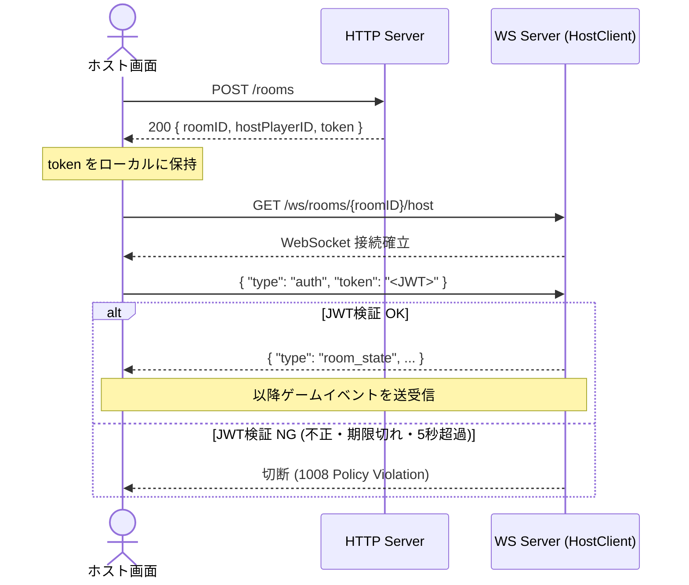
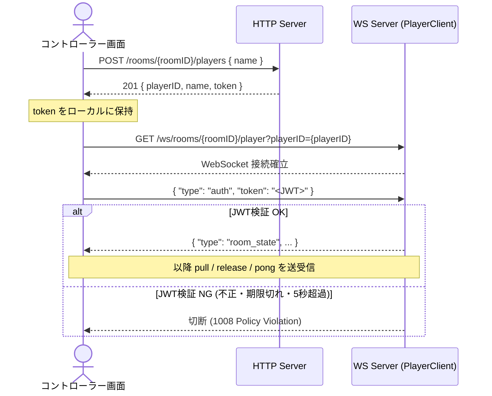
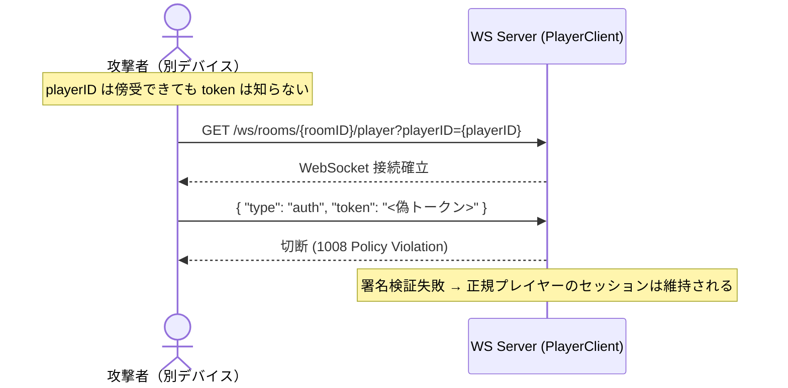

# 認証仕様

## 概要

DBなし・セッションなしのステートレスJWT方式。  
トークンはURLクエリパラメータに含めず、**WS接続後の最初のメッセージ**で送信する。  
これによりサーバーログへのトークン露出を防ぐ。

ペイロード: `{ playerID, roomID, expiresAt(24h) }` / 署名: HS256

---

## ホスト: ルーム作成 〜 WS接続



---

## プレイヤー: ルーム参加 〜 WS接続



---

## 再接続時のなりすまし防止



---

## JWT検証ロジック（サーバー側）

```
1. 最初のメッセージを 5秒 のタイムアウト付きで待機
2. { type: "auth", token: "..." } を受信
3. golang-jwt/jwt/v5 で署名・有効期限を検証
4. claims.playerID == URLの playerID（またはroom.hostPlayerID）
5. claims.roomID  == URLの roomID
6. すべて一致 → ゲームイベントループへ
7. いずれか失敗 → 1008 Policy Violation で即切断
```

---

## 環境変数

| 変数名 | 説明 | 生成方法 |
|---|---|---|
| `JWT_SECRET` | HS256署名キー（256bit以上推奨） | `make gen-secret` |

起動時に `JWT_SECRET` が空の場合はサーバーが `Fatal` で終了する。
